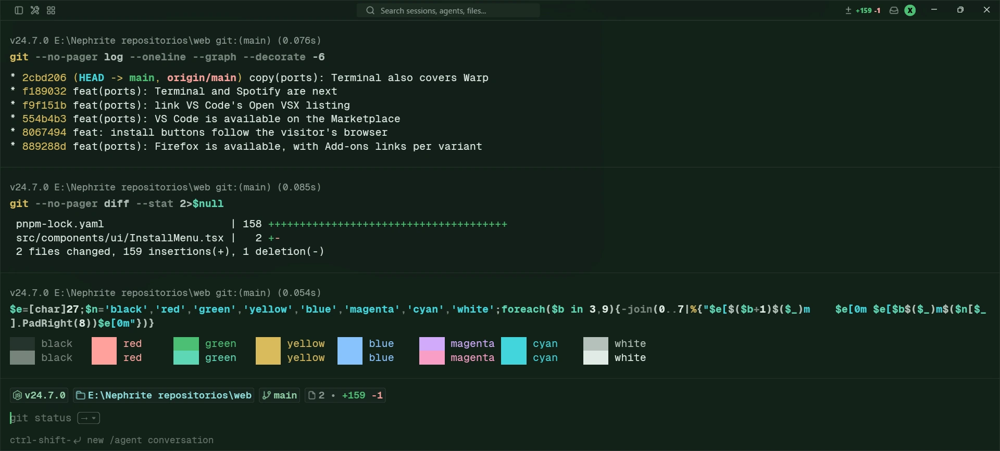
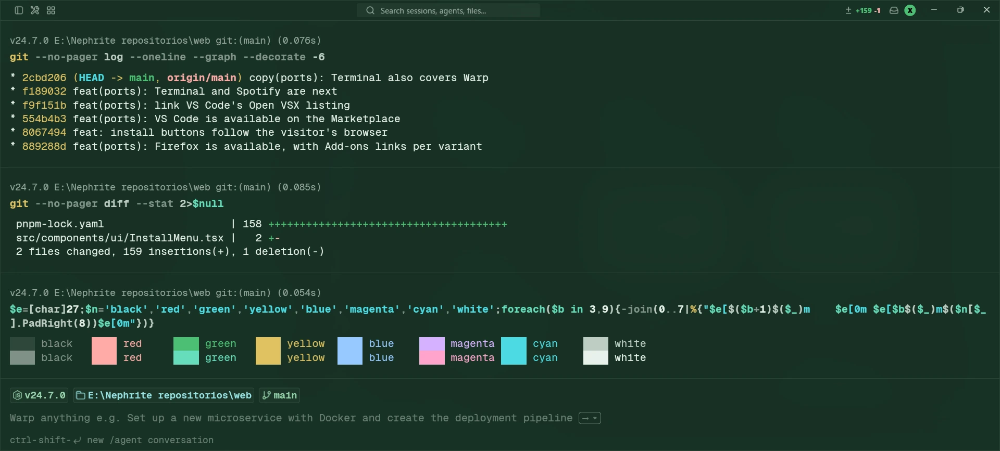
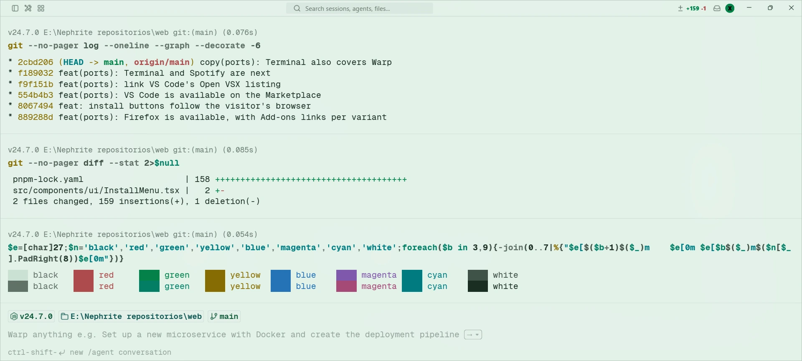

<div align="center">


# Nephrite para terminales

[English](README.md) · **Español**

Un esquema de color sereno, inspirado en el jade, para Windows Terminal, iTerm2, Alacritty, Kitty, Ghostty, Warp y WezTerm, en tres sabores.

[](LICENSE.es.md)
[](https://github.com/Nephrite-theme/palette)

</div>

## Sabores

| Sabor | Colores ANSI | Para |
| --- | --- | --- |
| **Forest** |  | Oscuro y profundo, para la noche |
| **Jade** |  | Oscuro con más verde, para jornadas largas |
| **Mint** |  | Claro y ligero, para el día |

## Capturas







## Instalación

Todos los archivos están en [`themes/`](themes), una carpeta por terminal. Cambia `forest` por `jade` o `mint` para otro sabor.

### Windows Terminal

1. Ejecuta esto en PowerShell. Guarda [`nephrite.json`](themes/windows-terminal/nephrite.json), con los tres sabores, en la carpeta de fragmentos de Terminal:

   ```powershell
   $dir = "$env:LOCALAPPDATA\Microsoft\Windows Terminal\Fragments\Nephrite"
   New-Item -ItemType Directory -Force $dir | Out-Null
   Invoke-WebRequest https://raw.githubusercontent.com/Nephrite-theme/terminal/main/themes/windows-terminal/nephrite.json -OutFile "$dir\nephrite.json"
   ```

2. Cierra todas las ventanas de Windows Terminal y ábrelo de nuevo.
3. Abre **Configuración > Perfiles > Valores predeterminados > Apariencia**, elige **Nephrite Forest** en **Combinación de colores** y haz clic en **Guardar**.

Para quitarlo, borra la carpeta `Fragments\Nephrite`. Si prefieres editar `settings.json` a mano, pega un solo sabor, como [`nephrite-forest.json`](themes/windows-terminal/nephrite-forest.json), dentro de su lista `"schemes"`.

### iTerm2

1. Descarga [`Nephrite Forest.itermcolors`](themes/iterm2/Nephrite%20Forest.itermcolors) y haz doble clic para importarlo.
2. Ve a **Settings > Profiles > Colors** y elígelo en **Color Presets**.

### Alacritty

Guarda [`nephrite-forest.toml`](themes/alacritty/nephrite-forest.toml) junto a tu configuración e impórtalo en `alacritty.toml`:

```toml
[general]
import = ["~/.config/alacritty/nephrite-forest.toml"]
```

### Kitty

Guarda [`nephrite-forest.conf`](themes/kitty/nephrite-forest.conf) en `~/.config/kitty/` y añade a `kitty.conf`:

```conf
include nephrite-forest.conf
```

### Ghostty

Guarda [`Nephrite Forest`](themes/ghostty/Nephrite%20Forest) en `~/.config/ghostty/themes/` y añade a tu configuración:

```conf
theme = Nephrite Forest
```

Para seguir la apariencia del sistema, usa `theme = light:Nephrite Mint,dark:Nephrite Forest`.

### Warp

Guarda [`nephrite-forest.yaml`](themes/warp/nephrite-forest.yaml) en la carpeta de temas de Warp y elige **Nephrite Forest** en **Settings > Appearance > Themes**:

- macOS: `~/.warp/themes/`
- Windows: `%APPDATA%\warp\Warp\data\themes\`
- Linux: `~/.local/share/warp-terminal/themes/`

### WezTerm

Guarda [`Nephrite Forest.toml`](themes/wezterm/Nephrite%20Forest.toml) en `~/.config/wezterm/colors/` y actívalo en `wezterm.lua`:

```lua
config.color_scheme = "Nephrite Forest"
```

## Colores

Todos los colores vienen de la [paleta Nephrite](https://github.com/Nephrite-theme/palette), asignados por rol:

| Superficie de la terminal | Color de la paleta |
| --- | --- |
| Fondo | `base` |
| Texto | `text` |
| Cursor | `jade`, con `base` para el carácter debajo |
| Selección | `surface2` detrás de `text` |
| Enlaces | `sapphire` |
| Barra de pestañas (Kitty, WezTerm) | `crust`, `base` para la pestaña activa y `mantle` para el resto |
| ANSI 0-15 | La asignación ANSI de la paleta: `garnet`, `jade`, `citrine`, `sapphire`, `amethyst`, `lagoon`, con `mint` y `rhodonite` como verde y magenta brillantes, y `overlay1` como negro brillante para el texto tenue |

## Desarrollo

Los archivos de `themes/` y `assets/` se generan, así que no los edites a mano. Para aplicar cambios de la paleta:

```sh
node scripts/sync-palette.mjs   # descarga el palette.json más reciente
node scripts/build.mjs          # regenera los esquemas de cada terminal
```

Para añadir una terminal, escribe en `scripts/build.mjs` una función que convierta los colores de un sabor al formato de esa terminal y llámala en el bucle de build. Node 18 o superior, sin dependencias.

## Contribuir

¿Usas una terminal que no está aquí, o encontraste un color que choca? [Abre un issue](https://github.com/Nephrite-theme/terminal/issues/new/choose) con una captura. Para saber cómo se construyen y revisan los ports de Nephrite, lee la [guía de contribución](https://github.com/Nephrite-theme/.github/blob/main/CONTRIBUTING.es.md).

## Agradecimientos

Creado y mantenido por [@ingfranciscastillo](https://github.com/ingfranciscastillo). Los colaboradores aparecerán aquí a medida que crezca la comunidad.

## Más Nephrite

Nephrite también está disponible para Chrome, Firefox y VS Code. Mira todas las apps en [getnephrite.dev/ports](https://getnephrite.dev/ports).
